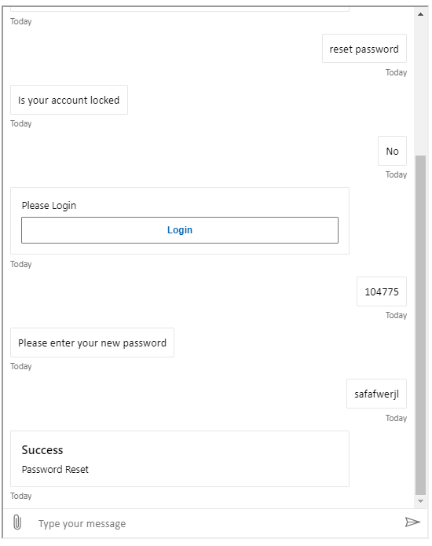

# Introduction

A sample Bot based on the Bot Framework that resets your password* with Azure AD Authentication
_Actual account passwords are not reset_

# Setup
## Manual Steps
* Create Azure AD Service Principal for Bot
    * $botPass = New-Password -Length 16 (Function from bjd.Common.Functions)
    * $botAppId = $(az ad app create --display-name bjdBotApp01 --password $botPass --available-to-other-tenants  --query 'appId' -o tsv) 
* Create Azure AD Service Principal for Bot Authentication 
    * $botAuthPass = New-Password -Length 16 (Function from bjd.Common.Functions PowerShell module)
    * $botAuthId = $(az ad app create --display-name bjdBotAuth01 --password $botAuthPass --reply-urls https://token.botframework.com/.auth/web/redirect --required-resource-accesses @infrastructure\azuread-manifest.json --query 'appId' -o tsv) 

## ARM Template 
* cd infrastructure 
* az group create --name BOT_RG --location southcentralus
* az group deployment create --name bot -g BOT_RG --parameters @azuredeploy.parameters.json --template-file .\azuredeploy.json --parameters botApplicationId=$botAppId botApplicationSecret=$botPass --verbose

## Post Template Configuration
* Access [Bot Service](https://portal.azure.com/#blade/HubsExtension/BrowseResourceBlade/resourceType/Microsoft.BotService%2FbotServices)
    * Navigate to your bot's Bot Channels Registration page on the Azure Portal.
    * Click Settings.
    * Under OAuth Connection Settings near the bottom of the page, click Add Setting.
    * Fill in the form as follows:
        * Name: AzureAD
        * Service Provider: Azure Active Directory v2
        * Client id: $botAuthId
        * Client Secret: $botAuthPass
        * Tenant: $Your_AzureAD_Tenant_ID
        * Token Exchange URL: Leave Blank
        * For Scopes: openid profile User.Read
    * Test Connection 
    * Channels > Web Chat > Copy WebChannelSecret
    * az webapp config appsettings set -n {{AzureAppServiceName}} -g BOT_RG --settings WebChannelSecret={{WebChannelSecret}}
* Deploy LUIS Modle via [Luis Portal](https://luis.ai) or the [LUIS cli tool](https://github.com/Microsoft/botbuilder-tools/tree/master/packages/LUIS)
    * Select the Subscription and the correct Authoring LUIS application
    * Import application 
    * Select Models\PasswordReset.json
    * Train 
    * Publish > Production 
    
# Deploy Bot Code
* Command Line
    * Update wwwroot\index.html with proper Bot Name
    * cd src
    * dotnet build
    * dotnet publish -o publish
    * copy -Recurse .\Cards\ .\publish\.
    * Compress-Archive -Path .\publish\* -DestinationPath bot.zip
    * az webapp deployment source config-zip --resource-group BOT_RG --name bjdbot010-api --src .\bot.zip
* Azure DevOps Pipeline 
    * Create new pipeline from deploy\azure-pipeline.yaml
    * Update Variables for Service Connection and Azure App Service Name 

# Bot
